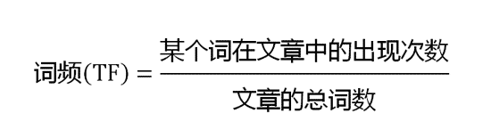
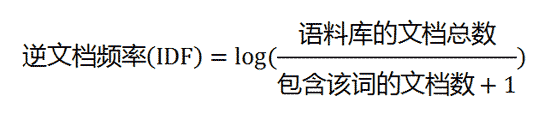
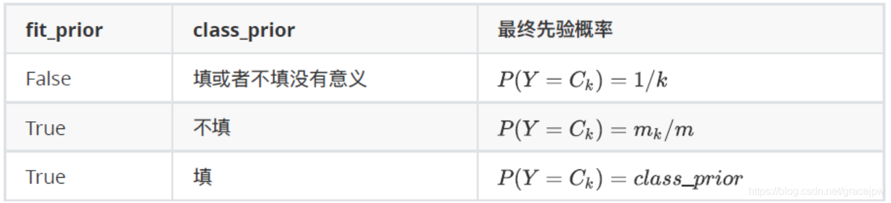

# Task4-论文种类分类

1. TF-IDF：实际上是：TF * IDF
    - TF(Term Frequency)：词频

        **词频**指的是某一个给定的词语在该文件中出现的频率。

        

    - IDF(Inverse Document Frequency)：逆文本频率指数

        **逆文本频率指数**指的是一个词语普遍重要性的度量。分母+1是为了防止分母为0

        

    TF-IDF倾向于过滤掉常见的词语，保留重要的词语。

    **优点**：简单快速，结果比较符合实际情况

    **缺点**：单纯以"词频"衡量一个词的重要性，不够全面，有时重要的词可能出现次数并不多。而且，这种算法无法体现词的位置信息，出现位置靠前的词与出现位置靠后的词，都被视为重要性相同，这是不正确的

2. sklearn里的TF-IDF
    1. 对应的包及示例数据

        ```python
        from sklearn.feature_extraction.text import CountVectorizer
        from sklearn.feature_extraction.text import TfidfTransformer

        # 测试用的数据
        texts = ['Chinese Beijing Chinese',
                 'Chinese Chinese Shanghai',
                 'Chinese Macao',
                 'Tokyo Japan Chinese']
        ```

    2. 生成方式及各参数
        - CountVectorizer()：通过词频实现文本特征提取

            创建词袋：

            ```python
            cv = CountVectorizer() # 生成词袋数据结构
            cv_fit = cv.fit_transform(texts) # 拟合模型，并返回文本矩阵
            ```

            得到结果：

            ```python
            # 得到结果：两种方式
            cv_fit.toarray() # 1：得到稀疏矩阵
            '''
             Out: array([[1, 2, 0, 0, 0, 0],
                         [0, 2, 0, 0, 1, 0],
                         [0, 1, 0, 1, 0, 0],
                         [0, 1, 1, 0, 0, 1]], dtype=int64)
            '''

            print(cv_fit) # 2：分别对应：元素在第几个列表，元素的索引，元素的词频
            '''
            Out: (0, 0)	1 # 第0个列表元素，词典中的索引为0，词频为1
                 (0, 1)	2
                 (1, 4)	1
                 (1, 1)	2
                 (2, 3)	1
                 (2, 1)	1
                 (3, 2)	1
                 (3, 5)	1
                 (3, 1)	1
            '''

            # 另外：
            print(cv_fit.toarray().sum(axis=0))  #每个词在所有文档中的词频
            # Out: [1 6 1 1 1 1]
            ```

            [CountVectorizer()常设参数](https://www.notion.so/465e1e64aa5b43b596f6e8e811c18080)

        - TfidfVectorizer()：通过TF-IDF实现文本特征提取

            创建TF-IDF词袋：

            ```python
            # 生成词袋数据结构
            tv = TfidfVectorizer(use_idf=True, smooth_idf=True, norm=None) 
            tv_fit = tv.fit_transform(texts) # 拟合模型，并返回文本矩阵
            ```

            得到结果：

            ```python
            # 得到结果：两种方式，和CountVectorizer一致
            tv_fit.toarray().round(4) # 1：得到稀疏矩阵（为排版仅保留4位小数）
            '''
            Out: array([[1.9163, 2.    , 0.    , 0.    , 0.    , 0.    ],
                        [0.    , 2.    , 0.    , 0.    , 1.9163, 0.    ],
                        [0.    , 1.    , 0.    , 1.9163, 0.    , 0.    ],
                        [0.    , 1.    , 1.9163, 0.    , 0.    , 1.9163]])
            '''

            print(tv_fit) # 2：分别对应：元素在第几个列表，元素的索引，元素的TFIDF值
            '''
            Out: (0, 1)	2.0
                 (0, 0)	1.916290731874155
                 (1, 1)	2.0
                 (1, 4)	1.916290731874155
                 (2, 1)	1.0
                 (2, 3)	1.916290731874155
                 (3, 1)	1.0
                 (3, 5)	1.916290731874155
                 (3, 2)	1.916290731874155
            '''
            ```

            [TfidfVectorizer参数(比CountVectorizer多了3个)](https://www.notion.so/1f343b3e051e4d668b3cb6a20b877520)

3. 使用sklearn里的classification_report评估模型

    classification_report：用于显示主要分类指标的文本报告．在报告中显示每个类的**精确度**，**召回率**，**F1值、出现次数**。

    ```python
    classification_report(y_true, y_pred)
    ```

    [classification_report()参数](https://www.notion.so/9a36b177ea4d4685bd1891ecc86158b6)

    关于各项参数的含义和计算方式，可见西瓜书第二章

    [classification_report()的输出](https://www.notion.so/1433d6dbda544c1cb0088c01381d747f)

4. sklearn中的MultiOutputClassifier

    MultiOutputClassifier：拓展二分类器，使其能实现多分类

    调用：

    ```python
    from sklearn.multioutput import MultiOutputClassifier
    ```

    使用：（以朴素贝叶斯为例）

    ```python
    clf = MultiOutputClassifier(MultinomialNB()) # 构造多分类器
    ```

    [MultiOutputClassifier（）的参数](https://www.notion.so/e3420cf48fa54c11ae4d565d0148a78a)

5. sklearn中的MultinomialNB

    MultinomialNB：多项式朴素贝叶斯

    **注意**：sklearn中的多项式朴素贝叶斯不接受负值输入（如果有负值需要将其标准化为正值）

    调用：

    ```python
    from sklearn.naive_bayes import MultinomialNB
    ```

    使用：

    ```python
    mnb = MultinomialNB()
    ```

    [MultinomialNB（）的参数](https://www.notion.so/72b21f76de4d4b8297809d9df9053c92)

    fit_prior、class_prior和先验概率的关系：

    
