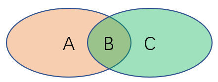

# Task01 决策树(上)

#### 参考

- 课程链接: [DataWhale/machine-learning-toy-code](https://datawhalechina.github.io/machine-learning-toy-code/index.html)

#### 练习

- 【练习】定义$X, Y$的联合熵为$H(Y, X)$为$E(Y,X)∼p(y,x)[−log_{2}p(Y,X)]$

  - 请证明如下关系： 
    $$
    G(Y, X)=H(X)-H(X|Y) \tag{1} \label{eq1}
    $$

    $$
    G(Y, X)=H(X)+H(Y)-H(Y, X) \tag{2} \label{2}
    $$

    $$
    G(Y, X)=H(Y, X)-H(X|Y)-H(Y|X) \tag{3} \label{3}
    $$

    **解答:** 

    (1)式: 信息增益的定义;
    
    (2)式:  
    
    由
    $$
    \begin{align*}
        H(Y, X) & = \sum_{x, y}p(x, y)log_{2}p(x, y) \\
        & = \sum_{x, y}p(x, y)[log_{2}p(x|y) + log_{2}p(y)] \\
        &=H(X|Y)+H(Y) \\
    \end{align*}
    $$
    得
    $$
    H(X|Y)=H(Y,X)-H(Y)
    $$
    带入(1)式即得(2)式
    
    (3)式:
    
    同理
    $$
    H(Y, X) = H(Y|X) + H(X)
    $$
    得
    $$
    H(X) = H(Y, X) - H(Y|X)
    $$
    带入(1)式即得(3)式
    
  - 下图被分为了A、B和C三个区域。若AB区域代表X的不确定性，BC区域代表Y的不确定性，那么$H(X)$、$H(Y)$、$H(X|Y)$、$H(Y|X)$、$H(Y,X)$和$G(Y,X)$分别指代的是哪片区域？

    

    **解答:**
    
    H(X):     A U B
    
    H(Y):     B U C
    
    H(X|Y): B
    
    H(Y|X): B
    
    H(X, Y): A U B U C
    
    G(X, Y): C
    
    

- 【练习】假设当前我们需要处理一个分类问题，请问对输入特征进行归一化会对树模型的类别输出产生影响吗？请解释原因。

  **解答:** 不会, 树模型只关注特征的顺序而非数值

  

- 【练习】如果将系数替换为$1−γ^2$，请问对缺失值是加强了还是削弱了惩罚？

  **解答:** 由$(1-γ^2)=(1-γ)(1+γ)$, 而$(1+γ)\geq1$, 故削弱了惩罚
  
  
  
- 【练习】如果将树的生长策略从深度优先生长改为广度优先生长，假设其他参数保持不变的情况下，两个模型对应的结果输出可能不同吗？

  **解答:** 如果不限制树深度和叶子节点的个数, 两种生长策略得到的结果是相同的, 因为每个子节点的条件熵并没有改变

- 【练习】在一般的机器学习问题中，我们总是通过一组参数来定义模型的损失函数，并且在训练集上以最小化该损失函数为目标进行优化。请问对于决策树而言，模型优化的目标是什么？

  **解答:** 由于在超参数确定的情况下, 树的生长是固定的, 若要优化决策树, 应该是通过剪枝来进行控制. 由于决策树强大的表示能力, 决策树的优化目标若只以最小化损失函数为目标, 会使得决策树在训练集上严重过拟合, 因此决策树的复杂度也是优化目标

  

- 【练习】对信息熵中的$log$函数在$p=1$处进行一阶泰勒展开可以近似为基尼系数，那么如果在$p=1$处进行二阶泰勒展开我们可以获得什么近似指标？请写出对应指标的信息增益公式。

  **解答:** 
  $$
  H(X)\approx\sum_{x}p(x)[1-p(x)+\frac{1}{2}(1-p(x))^2] \\
  H(X|Y)\approx\sum_{x,y}p(x,y)[1-p(x|y)+\frac{1}{2}(1-p(x|y))^2] \\
  G(X, Y)=H(X)-H(X|Y)
  $$
  

- 【练习】除了信息熵和基尼系数之外，我们还可以使用节点的$1−max_{k}p(Y=y_k)$和第$m$个子节点的$1−max_{k}p(Y=y_k|X=x_m)$来作为衡量纯度的指标。请解释其合理性并给出相应的信息增益公式。

  **解答:** 节点纯度反映的是节点样本标签的不确定性, 当一个节点的纯度较低时，说明每种类别都倾向于以比较均匀的频率出现, 当一个节点的纯度很高时，说明有些类别倾向于以比较高的频率出现. 当$max_{k}p(Y=y_k)$很大时, 说明有类别倾向以较高频率出现, 此时该节点的纯度较高; 同理$max_{k}p(Y=y_k)$较小时, 节点的纯度较低. 该指标能够一定程度上反应节点的纯度.
  $$
  H(X)= 1 - max_{k}p(x) \\
  H(X|Y) = \sum_{m}p(x_m)[1−max_{k}p(Y=y_k|X=x_m)] \\
  G(X, Y) = H(X) - H(X|Y)
  $$
  

- 【练习】为什么对没有重复特征值的数据，决策树能够做到损失为0？

  **解答:** 因为决策树能够一直生长直到拟合所有数据

  

- 【练习】如何理解min_samples_leaf参数能够控制回归树输出值的平滑程度？

  **解答:** 我认为min_samples_leaf大的时候, 相当于把min_samples_leaf大的时候的叶子节点合并, 相当于滑动平均, 也就使得输出值相对平滑了
  
  

#### 知识回顾

1. ID3树算法、C4.5树算法和CART算法之间有何异同？

   **解答:** 最主要的不同就是使用衡量节点纯度的指标不同. ID3使用信息增益, C4.5使用信息增益比, CART对分类问题使用基尼系数, 对回归问题使用MSE或MAE

   

2. 什么是信息增益？它衡量了什么指标？它有什么缺陷？

   **解答:** 信息增益: $G(X,Y) = H(X) - H(X|Y)$. 衡量了分裂节点降低的不确定度或提高的纯度. 对于类别众多的特征, 更容易得到更大的信息增益, 而这不符合常识中节点分裂的标准

   

3. sklearn决策树中的random_state参数控制了哪些步骤的随机性？

   **解答:** 1. max_feature选取的特征; 2. 某几个分裂的增益相同时的选取; 3. 回归时若使用随机分割法控制分割的随机性

   

4. 决策树如何处理连续变量和缺失变量？

   **解答:** 连续变量: 通过某种策略(随机或最优)找到最优分割的节点; 缺失变量: 设置惩罚$(1-γ)$

   

5. 基尼系数是什么？为什么要在CART中引入它？

   **解答:** 基尼系数为熵的近似, 是熵中log在p=1处的一阶泰勒展开. 为了减少计算代价

   

6. 什么是树的预剪枝和后剪枝？具体分别是如何操作的？

   **解答:** 预剪枝: 随着树生长进行的剪枝; 后剪枝: 树生长完毕后进行的剪枝
   
   预剪枝在树分裂节点时评估分裂后的收益, 对收益达不到要求的进行剪枝;
   
   后剪枝对树中对后续没有帮助的节点进行剪枝
   
   可通过min_samples_split, min_samples_split, min_samples_leaf, min_weight_fraction_leaf, max_leaf_nodes, min_impurity_decrease控制